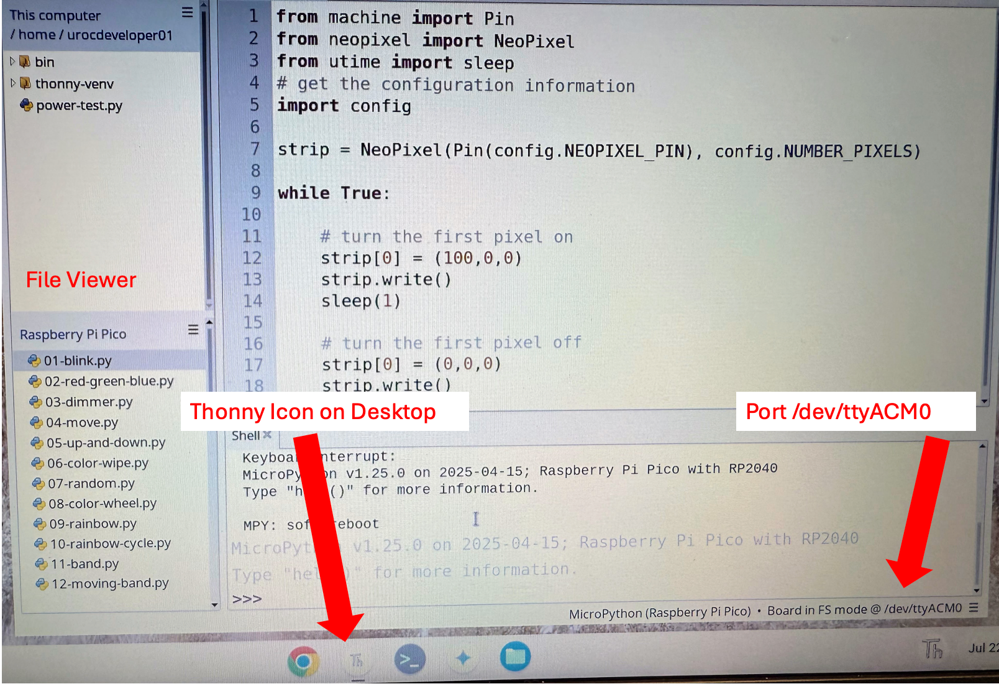

# Thonny Admin



We want to give our students a great experience using Thonny.  Here are a few things to
not about the screen image above.

1. There is a Thonny icon directly on the desktop
2. Thonny is configured to view both the files on the Raspberry Pi Pico (each lab has a file)
3. Thonny can see the port `/dev/ttyACM0` and can connect directly to the Pico

Getting to this stage is not difficult, but it does require going through
several steps.  Here is a quick summary of these steps:

1. Install Linux (Crostini)
2. Open the terminal and install pip 
3. Use pip to install Thonny
4. Run Thonny from the command line or setup a desktop icon

## Who Can Enable Linux (Crostini) on a Chromebook

### ✅ Allowed:

1. The Chromebook’s Owner account (the first Google account used to set up the device)
2. User accounts with Linux enabled by the owner or admin
3. Managed devices (school/work) only if the admin has allowed Linux

### ❌ Not Allowed:

1. Guest mode or Incognito users
2. Child accounts (Family Link) by default
3. Managed Chromebooks (e.g., issued by schools) where Linux is disabled via Google Admin Console

Secondary accounts on the Chromebook, unless Linux is enabled per user

## Steps

### Step 1: Install Linux

The only reliable way to run Thonny on a Chromebook to program a Raspberry Pi Pico is by using the Linux (Crostini) environment within ChromeOS. 

### Step 2: Install Pip

```sh
sudo apt update
sudo apt install python3-venv python3-pip -y
```

### Step 3: Install a Virtual Env and Put Thonny in it

```sh
python3 -m venv ~/thonny-venv
source ~/thonny-venv/bin/activate
pip install thonny
```

### Step 4: Run Thonny from the Terminal

```sh
~/thonny-venv/bin/thonny
```

Note:  You can also create an alias to make this command earlier.

### Faster Setup Process

### Step 1: Enable Linux Development Environment

[Go to the Setting up ChromeOS in Developer Mode](setting-up-developer-mode.md)


Note: Using `apt install thonny` can gives older versions, use the official installer:

```bash
# Update system first
sudo apt update

# Install latest Thonny with Python bundle
bash <(wget -O - https://thonny.org/installer-for-linux)
```

This method installs the current version (3.3.10+) rather than the outdated Debian package version, avoiding compatibility issues.

### Step 3: Configure USB Access
1. Go to **Settings** → **About ChromeOS** → **Developers** → **Linux development environment**
2. Click **Manage USB devices**
3. Connect your USB device (Arduino, Raspberry Pi Pico, etc.)
4. **Enable** the device in the list
5. Add user to dialout group: `sudo usermod -a -G dialout $USER`
6. **Restart** the Linux container (Settings → Developers → Linux → Advanced → Restart)

### Step 4: Create Desktop Launcher
Make Thonny easily accessible:

```bash
# Create desktop file for launcher
cat > ~/.local/share/applications/thonny.desktop << EOF
[Desktop Entry]
Name=Thonny
Comment=Python IDE for beginners
Exec=thonny %F
Icon=thonny
Terminal=false
Type=Application
Categories=Development;IDE;
MimeType=text/x-python;
EOF

# Make executable
chmod +x ~/.local/share/applications/thonny.desktop
```


### Batch Script Approach

Create a setup script to automate the software installation:

```bash
#!/bin/bash
# Save as setup_thonny.sh

echo "Setting up Thonny development environment..."

# Update system
sudo apt update

# Install Thonny
bash <(wget -O - https://thonny.org/installer-for-linux)

# Add user to dialout group
sudo usermod -a -G dialout $USER

# Create desktop launcher
cat > ~/.local/share/applications/thonny.desktop << EOF
[Desktop Entry]
Name=Thonny
Comment=Python IDE for beginners
Exec=thonny %F
Icon=thonny
Terminal=false
Type=Application
Categories=Development;IDE;
MimeType=text/x-python;
EOF

chmod +x ~/.local/share/applications/thonny.desktop

echo "Setup complete! Please restart Linux container and connect USB devices."
echo "Go to Settings > Developers > Linux > Manage USB devices to enable your hardware."
```

Run with: `bash setup_thonny.sh`


## Step-by-Step: Create a Thonny Launcher on ChromeOS

### 1. **Create a `.desktop` file**

Run this command in your Linux terminal:

```bash
nano ~/.local/share/applications/thonny.desktop
```

### 2. **Paste the following contents** (adjusting username if needed):

```ini
[Desktop Entry]
Version=1.0
Type=Application
Name=Thonny
GenericName=Python IDE
Comment=Thonny IDE for MicroPython and Python development
Exec=env TK_USE_PLATFORM_MENUBAR=0 /home/urocdeveloper01/thonny-venv/bin/thonny
Icon=python3
Terminal=false
Categories=Development;Education;IDE;
StartupNotify=true
```

> Replace `/home/urocdeveloper01/` with the correct path if your username is different. You can check your username with `whoami`.

### 💾 3. **Save and exit** the editor:

* Press `Ctrl+O` to save
* Press `Enter` to confirm the file name
* Press `Ctrl+X` to exit Nano

### 4. **(Optional) Add a custom icon**

If you want a real Thonny icon:

```bash
mkdir -p ~/.local/share/icons
wget https://en.wikipedia.org/wiki/Thonny#/media/File:Thonny_logo.png -O ~/.local/share/icons/thonny.png
```

Then change the `Icon=` line in the `.desktop` file:

```ini
Icon=/home/urocdeveloper01/.local/share/icons/thonny.png
```

### 5. **Refresh the launcher**

Now restart your Linux container or run:

```bash
update-desktop-database ~/.local/share/applications
```

Then:

* Open your ChromeOS launcher
* Scroll down to **“Linux apps”**
* You should now see **Thonny** with a Python icon!

You can right-click it and pin it to the shelf for even faster access.
