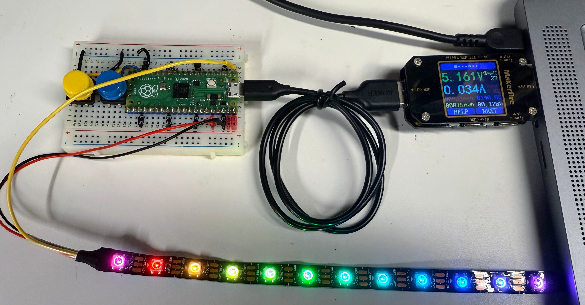

# Measuring Power Draw



We can purchase a low cost USB power monitor on e-Bay for under $7.00:

[eBay Search for USB Power Meter Voltage Current](https://www.ebay.com/sch/i.html?_nkw=USB+Power+Meter+Voltage+Current&_sacat=0&_odkw=USB+Power+Monitor&_osacat=0&_sop=15&_ipg=200)

Although these meters are no accurate for current under 30 milliamps, they are very low cost and easy to use.

Just place the USB Power Meter between your USB port and the device under test.  Many of these meters
show the voltage input (which should be about 5 volts) and the current passing through.

## Calculating Power from Current

Calculating USB Power Consumption

### Basic Formula
Power consumption from a USB port is calculated using the fundamental electrical equation:
Power (Watts) = Voltage (Volts) × Current (Amperes)

### Standard USB Voltage

USB ports provide a standardized 5 volts (though this may drop slightly under heavy load to around 4.5-4.8V).
Simple Calculation

For a standard 5V USB port:

Power (W) = 5V × Current (A)

Practical Examples:

- Device drawing 0.1A (100mA): 5V × 0.1A = 0.5 watts
- Device drawing 0.5A (500mA): 5V × 0.5A = 2.5 watts
- Device drawing 0.9A (900mA): 5V × 0.9A = 4.5 watts

### USB Power Limits

- USB 2.0: Maximum 500mA (2.5W)
- USB 3.0: Maximum 900mA (4.5W)
- USB-C/PD: Can negotiate higher voltages and currents

## Quick Reference

If your USB power meter shows current in milliamps (mA), convert to amps by dividing by 1000, then multiply by 5:

Power (W) = 5 × (Current in mA ÷ 1000)

This calculation is essential when working with microcontrollers like the Raspberry Pi Pico to ensure you stay within USB power specifications and avoid triggering overcurrent protection.

## Power Draw Test on an LED Strip

We can check how much power an short LED strip draws by setting the pixels to various
colors and then measuring the total current being drawn.  In the sample
code below we turn all 12 pixels on with different colors at maximum brightness.

In the code below, we fist turn on all the red LEDs, then green and then blue.  After that we turn all three on and we can get the maximum current drawn.

In while running the `sleep()` function mode, the Raspberry Pi Pico draws about 19.07 milliamps.

```python
# Power Test
# Draw all the pixels a specific color and intensity and then watch the current
# Use a USB current meter
from machine import Pin
from neopixel import NeoPixel
from utime import sleep
# get the configuration information
import config

np = config.NUMBER_PIXELS
strip = NeoPixel(Pin(config.NEOPIXEL_PIN), np)

# give enough time for the current meter to stabilize
sleep_time = 5
while True:
    
    # make the strip red - the total power should be around 30 milliamps for a 12 pixel LED strip
    for i in range(0,np):
        strip[i] = (255,0,0)
        strip.write()
    sleep(sleep_time)
   
    # make the strip green
    for i in range(0,np):
        strip[i] = (0,255,0)
        strip.write()
    sleep(sleep_time)
    
    # make the strip blue
    for i in range(0,np):
        strip[i] = (0,0,255)
        strip.write()
    sleep(sleep_time)
    
    # make the strip white total power should be around 45 milliamps
    for i in range(0,np):
        strip[i] = (255,255,255)
        strip.write()
    sleep(sleep_time)
    
    # turn off the strip
    for i in range(0,np):
        strip[i] = (0,0,0)
        strip.write()
        sleep(.05)
    sleep(sleep_time)
```